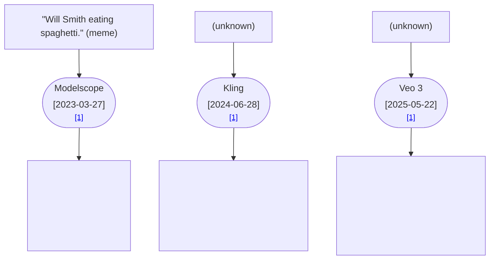

# Why character designs?

### Example: text-to-video benchmarks

<!--
Another example, and one that's less solved, is that of text-to-video models. In this case, the benchmark is to generate an image of Will Smith eating spaghetti. The first example is a meme, but you can get a sense of how much more fidelity more modern models have.
-->
